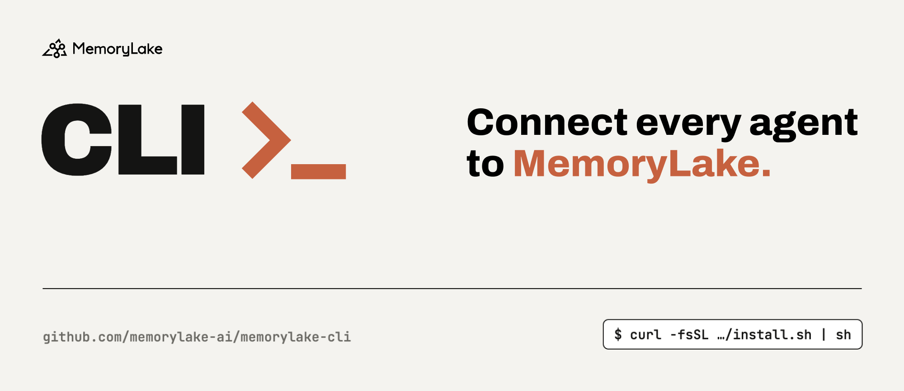
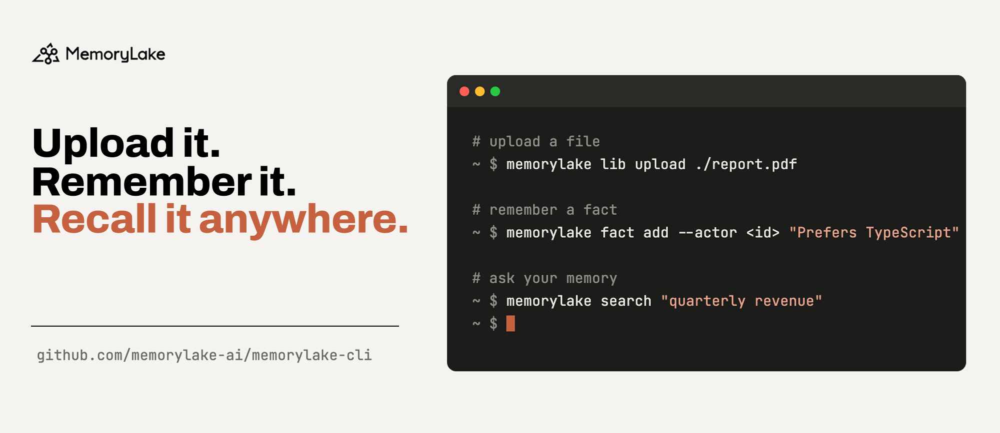

<p align="center">
  <a href="https://memorylake.ai">
    
  </a>
</p>

<p align="center">
  <a href="https://github.com/memorylake-ai/memorylake-cli/actions/workflows/ci.yml"></a>
</p>

Command-line interface for [MemoryLake](https://app.memorylake.ai). Upload files,
store and search memories, and manage the workspaces, projects, actors and agents
they belong to.

Every command prints the API response as pretty JSON, so anything here pipes into
`jq`.

## Install

**macOS / Linux**

```bash
curl -fsSL https://raw.githubusercontent.com/memorylake-ai/memorylake-cli/main/scripts/install.sh | sh
```

**Windows (PowerShell)**

```powershell
irm https://raw.githubusercontent.com/memorylake-ai/memorylake-cli/main/scripts/install.ps1 | iex
```

Both verify the download against its published SHA-256 and refuse to install on a
mismatch. Re-running upgrades in place. On a first install they walk you through
logging in and picking a workspace; `MEMORYLAKE_VERSION`,
`MEMORYLAKE_INSTALL_DIR`, `MEMORYLAKE_INSTALL_NAME` and `MEMORYLAKE_NO_SETUP`
override the details — see the comments at the top of either script.

### Installing without prompts

Supply the credentials and nothing is asked — useful for a link handed out by a
console, and for CI, where there is no one to prompt:

```bash
curl -fsSL https://raw.githubusercontent.com/memorylake-ai/memorylake-cli/main/scripts/install.sh \
  | sh -s -- --api-key sk-… --workspace ws-… [--base-url URL]
```

```powershell
# `irm | iex` cannot pass parameters, so Windows uses the environment
$env:MEMORYLAKE_API_KEY='sk-…'; $env:MEMORYLAKE_WORKSPACE='ws-…'
irm https://raw.githubusercontent.com/memorylake-ai/memorylake-cli/main/scripts/install.ps1 | iex
```

Every flag has an environment variable (`MEMORYLAKE_API_KEY`,
`MEMORYLAKE_WORKSPACE`, `MEMORYLAKE_BASE_URL`); a flag wins over its variable.
**Supplied credentials replace whatever is already stored** — that is the point
when a console hands out a key. The key is validated before anything is written,
so one that will not work leaves your existing configuration untouched.

A key on the command line is recorded in your shell's history. Prefer a
short-lived key where that matters.

Prefer not to pipe a script into your shell? Download an archive from the
[releases page](https://github.com/memorylake-ai/memorylake-cli/releases), check
it against its `.sha256`, and put `memorylake` on your `PATH`.

### Upgrading

Re-run the same install command. It replaces the binary in place and leaves your
credentials and workspace alone — an install that is already logged in is not
asked to set anything up again.

```bash
memorylake version    # v20260818.1 — which release this is
```

A build that was not produced by the release workflow says so (`0.1.0 (dev
build)`), so it cannot be mistaken for one.

## Getting started

<p align="center">
  
</p>

```bash
memorylake auth login          # pick an endpoint, then paste your API key
memorylake workspace use       # pick a default workspace from a list

memorylake project create --name "Research" --custom-id research-1
memorylake lib upload ./report.pdf
memorylake project document import --project proj-… <item-id> --wait

memorylake search "what were the quarterly revenue figures"
```

`workspace use` remembers a workspace, so `--workspace` can be omitted everywhere
after it. Pass it explicitly to override for a single command.

## Commands

Aliases: `ws` = `workspace`, `proj` = `project`, `lib` = `library`,
`doc` = `document`, `conv` = `conversation`, `msg` = `message`,
`key` = `api-key`, `invite` = `invitation`.

### Auth

```bash
memorylake auth login                          # interactive: endpoint, then API key
memorylake auth login --api-key sk-… [--base-url URL] [--profile NAME]
memorylake auth status                         # who am I, and where did it come from
memorylake auth switch <profile>
memorylake auth refresh
memorylake auth logout
```

Interactive login offers the **Global** (`app.memorylake.ai`) and **China**
(`app.memorylake.cn`) endpoints, or a URL you type. They are separate
deployments: an account on one does not exist on the other. Choose one
non-interactively with `--base-url`.

### Workspaces

```bash
memorylake ws list [--name FUZZY] [--page-size N] [--continuation-token TOKEN]
memorylake ws create --name "My Workspace" --custom-id my-ws-001
memorylake ws get <id> [--by-custom-id]
memorylake ws update <id> [--name NAME] [--description D] [--metadata '{"team":"core"}']

memorylake ws use              # pick a default from a list
memorylake ws use <id>         # or name one
memorylake ws current          # which one is in effect, and why
memorylake ws use --clear
```

`update` changes only the fields you pass. `--metadata` takes a JSON object of
strings and **replaces** the stored map; `--metadata '{}'` clears it. There is
deliberately no `ws delete`: deleting a workspace takes everything in it, and
that is not something to leave one typo away from an agent driving the CLI.

### Actors

An actor is who a memory is attributed to. Actors exist account-wide and must be
bound to a workspace to participate there.

```bash
memorylake actor create --custom-id user-001 --display-name "Alice Chen" \
  [--description TEXT] [--tags vip,cn] \
  [--metadata '{"tier":"premium"}']

memorylake actor list [--name FUZZY] [--tags vip,cn] [--page-size N]
memorylake actor me
memorylake actor get <id> [--by-custom-id]
memorylake actor update <id> [--display-name NAME] [--description D] \
  [--tags vip,cn | --clear-tags] [--metadata JSON]
memorylake actor delete <id>

memorylake actor bind   --actor <id> [--workspace <id>]
memorylake actor unbind --actor <id> [--workspace <id>]
memorylake actor list   --workspace <id>        # bindings, not actors
```

`--custom-id` is unique account-wide. On update, `--metadata` **replaces** the
stored value rather than merging into it.

`actor me` reports the actor your API key represents, so a script never has to
guess which of several human actors is yours:

```bash
memorylake actor me | jq -r .id
```

**It is not necessarily bound to a workspace** — the actor comes with the
account, while joining a workspace is a separate step. To know who can write in
one, use `actor list --workspace <id>`; to put this actor there, `actor bind`.

Tags are short labels for grouping and filtering: up to 20 per actor, each 1-64
characters, no commas. Matching is exact and case-sensitive — `VIP` and `vip` are
two different tags. Prefer them over `--metadata` for anything you want to filter
on, because metadata is not filterable.

```bash
memorylake actor list --tags vip          # actors tagged vip
memorylake actor list --tags vip,cn       # tagged BOTH vip and cn, not either
```

`--tags` on update replaces the whole list, like `--metadata`; `--clear-tags`
removes every tag. Leaving both out keeps the actor's tags as they are.

### Projects

A project holds documents, conversations and the facts extracted from them.

```bash
memorylake proj list [--name FUZZY] [--page-size N] [--continuation-token TOKEN]
memorylake proj create --name "My Project" --custom-id my-proj-001 [--description D] \
  [--industry-ids research/academic,financial/markets]
memorylake proj get <id> [--by-custom-id]
memorylake proj update <id> [--name NAME] [--description D] \
  [--industry-ids IDS | --clear-industries]
memorylake proj delete <id>
memorylake proj stats <id>     # document/database counts by processing status
```

`--custom-id` is unique within the workspace. `--industry-ids` attaches public
industry opendata (see `industry list`); on update it **replaces** the attached
set, `--clear-industries` detaches them all, and leaving both out keeps them.
`stats` takes the project id only, not its custom_id.

### Library

The Library is MemoryLake's file system. `MY_SPACE` is the workspace root, and is
accepted anywhere an item id is.

```bash
memorylake lib list [<item-id>] [--page-size N] [--continuation-token TOKEN] [--xattr-keys k1,k2]
memorylake lib get <item-id>
memorylake lib mkdir "Reports" [--parent <item-id>] [--on-conflict rename|deny] [--xattrs JSON]
memorylake lib upload ./report.pdf [--parent <item-id>] [--name NAME] \
  [--on-conflict rename|deny|overwrite|replace] [--xattrs JSON]
memorylake lib delete <item-id>

memorylake lib xattr set    <item-id> --attrs '{"team":"core"}'
memorylake lib xattr delete <item-id> --keys team,owner
```

Extended attributes are string key/value tags on an item. `xattr set` merges
into what is there; `--xattrs` sets them when the item is created; `list
--xattr-keys` limits the `x_attrs` shown to the keys you name. System keys such
as `x_source` cannot be changed, and the server reports success without
changing them.

`upload` streams the file in parts and retries transient failures; the file
appears only once it completes. `--on-conflict` decides what happens when the
name is taken — the default `rename` appends `_N`, so read the `name` in the
output rather than assuming the one you asked for. `overwrite` and `replace`
apply to files only.

### Documents

Documents are Library files imported into a project and indexed for search.

```bash
memorylake proj doc import --project <id> <item-id>... \
  [--recursive] [--max-files 500] [--wait] [--timeout 600]

memorylake proj doc list   --project <id> [--name FUZZY] [--page-size N]
memorylake proj doc get      --project <id> <doc-id>
memorylake proj doc download --project <id> <doc-id> [-o PATH] [--force]
memorylake proj doc delete   --project <id> <doc-id>...
memorylake proj doc inspect  --project <id> <doc-id>...   # up to 100
memorylake proj doc reload   --project <id> <doc-id>
```

Upload files with `lib upload` first. A folder id needs `--recursive`, and
`--max-files` caps how many files one command may import.

Importing is asynchronous: the command returns once the server accepts the batch,
and each document moves through `pending` / `running` to `okay` or `error`.
`--wait` polls until they settle. Giving up does not cancel anything — the import
carries on server-side.

The API answers `200` even when individual files fail, so the CLI prints the full
payload and then exits non-zero if anything went wrong. Files already in the
project count as duplicates, not failures.

`download` writes the original file under the name the server reports, in the
current directory. `-o` takes a file path or a directory, and `-o -` streams to
stdout for piping. An existing file is never replaced without `--force`.

`inspect` returns what processing produced for each document, including
pre-signed links to the stored artifacts; anyone holding such a link can fetch
the file until it expires, so treat the output as sensitive. Documents in
`error` have nothing to inspect and are left out; the CLI names them on stderr.
`reload` re-queues a document that ended in `error`; any other status is
refused.

### Databases

A project can use a relational database as memory. Three links make the chain:
a **connection** (`db-connection`, account-wide) holds how to reach a database
and its credentials; a **datasource** (`datasource`, in a workspace) picks one
schema of a connection and indexes it; a **database memory** (`proj db`) adds a
datasource of the project's workspace to the project. Create them in that order,
and delete them in the reverse one — a connection or datasource still in use
cannot be deleted.

```bash
memorylake dbconn test   --host H [--port 5432] --username U --database D --password-env PGPASSWORD
memorylake dbconn create --name N --host H [--port P] --username U --database D \
  (--password-env VAR | --password-stdin | --password-file PATH) [--description D] [--custom-id ID]
memorylake dbconn list [--name FUZZY] [--page-size N] [--continuation-token TOKEN]
memorylake dbconn get <id> [--by-custom-id]
memorylake dbconn update <id> [--name N] [--description D] [--host H] [--port P] \
  [--username U] [--database D] [password source]
memorylake dbconn schemas <id>
memorylake dbconn delete <id>

memorylake ds create --connection <conn-id> --schema public --name N \
  [--description D] [--custom-id ID] [--table-filter REGEX]
memorylake ds list [--connection <conn-id>] [--name FUZZY] [--page-size N]
memorylake ds get <id> [--by-custom-id]
memorylake ds update <id> [--name N] [--description D] [--table-filter REGEX]
memorylake ds build <id>
memorylake ds tables <id> [--name FUZZY]
memorylake ds columns <id> --table T
memorylake ds annotate <id> --table T [--column C] [--comment TEXT] [--embedding true|false]
memorylake ds annotate <id> (--edits '<json array>' | --edits-file edits.json)
memorylake ds delete <id>

memorylake proj db create --project <id> --datasource <ds-id> --name N \
  [--instruction TEXT | --instruction-file PATH] [--analysis-model <id>]
memorylake proj db list   --project <id> [--page-size N]
memorylake proj db get    --project <id> <db-id>
memorylake proj db update --project <id> <db-id> [--name N] \
  [--instruction TEXT | --instruction-file PATH | --clear-instruction] \
  [--analysis-model <id> | --clear-analysis-model]
memorylake proj db reload --project <id> <db-id>
memorylake proj db generate-instruction --project <id> <db-id>
memorylake proj db delete --project <id> <db-id>
```

There is no `--password` flag, because a value there ends up in shell history.
Pass the password through an environment variable, standard input, or a file, or
type it at the prompt when running interactively. It is write-only: no command
prints it, and `-vvv` traces show `REDACTED` in its place. Changing a
connection's host, port, user or database means passing the password again.
Run `dbconn test` before `create`, with the same host, port, username, database
and password source: it saves nothing and names credential and reachability
problems, while a failed `create` may only say `INTERNAL_ERROR`. Should a
server error quote the password back, the CLI prints `REDACTED` in its place.

A datasource covers exactly one schema for now; `dbconn schemas` lists the
choices. Creating a datasource starts its first index build, and `ds build`
starts another. Both run in the background — `ds get` shows a non-empty
`building_version` until the build finishes. Annotations and `--embedding`
changes take effect on the next build.

`generate-instruction` drafts an instruction and prints it as
`{"instruction": ...}` without saving it. To keep it, capture it first and save
it only if that worked (`jq -e` fails when there is no draft):

```bash
draft=$(memorylake proj db generate-instruction --project P DB | jq -er .instruction) \
  && memorylake proj db update --project P DB --instruction "$draft"
```

`--instruction-file` drops one trailing newline and refuses empty or blank
content, so an empty pipe can never wipe a saved instruction. To remove the
instruction on purpose, use `proj db update ... --clear-instruction`.

### Facts

A fact is one remembered statement, owned by exactly one actor, project, or agent.
`<scope>` below is one of `--actor <id>`, `--project <id>`, or `--agent <id>`.

```bash
memorylake fact add <scope> "fact text" ["another" ...]
memorylake fact get <scope> <fact-id>
memorylake fact update <scope> <fact-id> [--text TEXT] [--metadata '{"k":"v"}']
memorylake fact trace <scope> <fact-id>
memorylake fact delete <scope> <fact-id>...
memorylake fact list [--actors a,b] [--projects a,b] [--agents a,b] [--query TEXT]
  [--page-size N] [--continuation-token TOK]
```

Facts are stored verbatim and are searchable immediately. `fact update` edits
one in place; its `--metadata` replaces the stored object whole (`'{}'` clears
it). `fact trace` shows every add, edit, and forget, newest first — forgotten
facts included. `fact list` needs at least one of `--actors` / `--projects` /
`--agents` (50 distinct owners at most) and tags each fact with its `owner`.

The server records contradictions between a scope's facts (and between a
project's facts and its documents) as conflicts for review:

```bash
memorylake fact conflict list <scope> [--resolved BOOL] [--category m2m|m2d|self]
  [--conflict-type logical|knowledge] [--stale BOOL] [--page-size N]
memorylake fact conflict get <scope> <conflict-id>
memorylake fact conflict resolve <scope> <conflict-id> --strategy dismiss
memorylake fact conflict resolve <scope> <conflict-id> --strategy keep_fact --keep-fact-id <fact-id>
memorylake fact conflict resolve <scope> <conflict-id> --strategy edit_fact --edit "<fact-id>=new text"
```

`m2m` conflicts take `keep_fact` or `dismiss`, `m2d` take `trust_fact`,
`trust_document`, or `dismiss`, and `self` take `edit_fact` or `dismiss`.

Each scope's fact instruction — Markdown saying what its memory is about and
what it is not — steers what the server records there:

```bash
memorylake fact instruction get <scope>
memorylake fact instruction set <scope> (--text TEXT | --file instruction.md | --file -)
memorylake fact instruction clear <scope>
memorylake fact instruction draft <scope> [--guidance TEXT] [--language "Simplified Chinese"]
  [--use-existing-facts] [--use-documents]
```

`set` replaces the instruction whole (2000 characters at most); `clear` restores
the built-in default. `draft` asks a language model for a candidate and takes a
few seconds; it saves nothing — review it, then `set` it. `--language` is an
English language name, not a locale tag like `zh-CN`.

### Conversations

A conversation is a log of messages that the server turns into memory in the
background.

```bash
memorylake conv create --custom-id session-42 --project <id> --actors a1[,a2] \
  [--name "Q3 Planning"] [--kind DIRECT|GROUP] [--metadata k=v ...]

memorylake conv list [--page-size N] [--continuation-token TOKEN]
memorylake conv get <id> [--by-custom-id]
memorylake conv cook-status <id> [--by-custom-id]
memorylake conv delete <id>

memorylake conv msg append <conv-id> --actor <id> --custom-id msg-42 \
  (--text "hello" ... | --content-json '<blocks>' | --content-file blocks.json) \
  [--parent <msg-id>] [--timestamp ISO8601] [--metadata k=v ...] [--wait [--timeout 600]]

memorylake conv msg list <conv-id> [--page-size N] [--continuation-token TOKEN]
memorylake conv msg get  <conv-id> <msg-id>...            # up to 100, in the order given

memorylake conv fact-actions <conv-id> (--project <id> | --actor <id>) \
  [--message <msg-id>] [--by-custom-id] [--page-size N] [--continuation-token TOKEN]
memorylake conv consumed-messages <conv-id> --message <msg-id> [--by-custom-id]
```

Message content is a list of typed blocks. Each `--text` becomes one `TEXT`
block; use `--content-json` / `--content-file` for `FILE`, `IMAGE`, `THINKING`,
`TOOL_USE` and `TOOL_RESULT`.

Every message names the one it follows. Without `--parent` the command looks the
conversation's latest message up for you, which is why it needs a workspace then
— pass `--parent <id>` to skip the lookup.

Appends to one conversation are serialized, so two at once leave one caller with
a `409`. Retrying is safe because `--custom-id` makes it idempotent — the same id
returns the message created the first time. After a `409`, re-read `msg list` and
retry with `--parent` set to the current last message.

Memory lags messages: an appended message is stored immediately but is not
searchable until the server has processed it. `cook-status` reports when that is
done, and `--wait` polls for you. Facts drawn from a conversation are attributed
by the server to an actor or a project as it sees fit, so look under both
`fact list --actors` and `fact list --projects`.

`fact-actions` is the audit trail of that process: which facts a conversation
added, changed or removed in one project's or one actor's memory (an agent's
memory is its actor's). `consumed-messages` lists the messages the server read
when it processed a given one. For both, `--by-custom-id` applies to the
conversation only; message ids are always internal ids.

### Agents

```bash
memorylake agent list [--name FUZZY] [--page-size N]
memorylake agent create --name "Support" --custom-id support-1 \
  [--model M] [--system-prompt P] [--description D] [--config agent.json]
memorylake agent get <id> [--by-custom-id]
memorylake agent update <id> [--name NAME] [--description D] [--config identity.json]
memorylake agent delete <id>
memorylake agent fork <id> --custom-id support-2 [--name NAME] [--metadata '{"k":"v"}']

memorylake agent version create <id> [--model M] [--system-prompt P] \
  [--config version.json] [--from-version latest|N]
memorylake agent version list <id>
memorylake agent version get <id> <version>

memorylake agent bind   <id> --workspace <id>
memorylake agent unbind <id> --workspace <id>
memorylake agent bindings [--workspace <id>] [--name FUZZY]
```

Creating an agent also creates an actor identity for it, returned as `actor_id`.
An agent works only in the workspaces it is bound to.

`fork` copies an agent into a new one under a new custom_id; the name defaults
to the original's with ` (copy)` appended. External agents cannot be forked.

Changes split in two. `agent update` changes identity — `name`, `description`,
`metadata` — in place. Anything about behaviour (`model`, `system_prompt`,
`policies`, `capabilities`, `output`, `subagents`, `skills`, …) creates a new
immutable version through `agent version create`; passing one of those to
`update` is rejected up front.

Structured fields come from a JSON file:

```bash
cat > agent.json <<'JSON'
{
  "name": "Support",
  "custom_id": "support-1",
  "model": "claude-sonnet-4-20250514",
  "policies": { "max_turns": 8, "deny_tools": ["shell"] }
}
JSON

memorylake agent create --config agent.json
memorylake agent create --config agent.json --model X   # flags win over the file
```

Unknown top-level keys are forwarded to the API unchanged, so a newer server
field works without upgrading the CLI. `--from-version latest|N` starts from an
existing version and applies your overrides on top, replacing whole top-level
keys rather than deep-merging.

### Talking to an agent (A2A)

Every agent bound to a workspace answers over the
[A2A protocol](https://a2a-protocol.org). The CLI speaks A2A v1.0 over
HTTP+JSON; `--workspace` defaults to the remembered one, as for `agent bind`.

```bash
memorylake agent card <agent-id> [--workspace <id>]

memorylake agent send <agent-id> --text "..." [--text "..."] \
  [--context CTX] [--task TASK] [--stream | --no-wait] [--raw] \
  [--actor ID] [--project ID] [--read-only-project ID]... [--skip-memory] \
  [--metadata-json '{"overrides":{...}}'] [--workspace <id>]
memorylake agent send <agent-id> --message-json '[{"text":"..."},{"url":"...","mediaType":"image/png"}]'
memorylake agent send <agent-id> --message-file parts.json

memorylake agent task list <agent-id> [--context CTX] [--status STATE] \
  [--page-size N] [--page-token TOK] [--after TIMESTAMP] [--history-length N] [--artifacts]
memorylake agent task get      <agent-id> <task-id> [--history-length N]
memorylake agent task subscribe <agent-id> <task-id> [--raw]
memorylake agent task cancel   <agent-id> <task-id>
memorylake agent task feedback <agent-id> <task-id> --rating up|down [--comment TEXT]
```

`send` waits for the answer and prints the reply text on stdout; the task id,
context id and final state go to stderr, so a script can pipe the reply and
still know how to continue:

```
$ memorylake agent send agent-… --text "Summarize yesterday's standup"
The team agreed to …
task run-…  context 5fdb…  state TASK_STATE_COMPLETED
```

Pass `--context` to keep talking in the same thread. A task that ends in
`TASK_STATE_INPUT_REQUIRED` needs more from you: reply with `--task <id>
--context <id>`. `--stream` prints the reply as it is produced; `--no-wait`
returns the task as soon as it exists (poll it with `agent task get`, or follow
it with `agent task subscribe`, which prints like `--stream`); `--raw` prints the
protocol response as JSON instead of the reply text.

The `--actor`, `--project`, `--read-only-project` and `--skip-memory` flags set
MemoryLake's extension of the request (`metadata.memorylake`): whose message it
is, which projects the agent may read and write, and whether the exchange is
remembered at all. Anything else the extension accepts, such as `overrides`,
goes through `--metadata-json`.

Feedback is a MemoryLake extension to A2A. `task feedback` records a rating on
the task; `task get` reads it back under `metadata."task-feedback/v1"`.

### Skills

```bash
memorylake skill list [--name FUZZY] [--page-size N] [--continuation-token T]
memorylake skill create --name equity-research --title "Equity Research" \
  [--description D] (--package skill.zip | --package-uri URI)
memorylake skill get <id>
memorylake skill update <id> [--title T] [--description D]
memorylake skill delete <id>
memorylake skill upload skill.zip            # prints {"s3_uri": ...}

memorylake skill version create <id> (--package skill.zip | --package-uri URI) [--changelog TEXT]
memorylake skill version list <id>
memorylake skill version get <id> <version>
```

A skill is a ZIP archive with a `SKILL.md` at its root or one directory down, at
most 10 MiB. `--package` uploads the archive and publishes it in one step; the
CLI takes a ready-made `.zip` rather than a directory, so zip it first
(`cd my-skill && zip -r ../my-skill.zip .`). `skill upload` only uploads and
prints the storage URI, which `--package-uri` accepts in place of `--package`.
If a `--package` publish fails after the upload, the error names that URI so
the retry can skip the upload. Skill names must be unique in the team.

Every published version goes through a security review: it starts `pending`
and settles on `safe`, `blocked` or `error` — `skill get` shows the latest
version's state as `latest_security_status`. Only a reviewed (`safe`) skill can
be referenced from an agent, as `"skills": [{"skill_id": "...", "skill_version": N}]`
in an `agent create` / `agent version create` config (omit `skill_version` to
follow the latest); anything else is refused with `SKILL_NOT_USABLE`. Publishing
a new version makes agents that follow the latest wait for its review, while
agents pinned to an older version are unaffected.

### Boundaries

```bash
memorylake boundary list [--workspace <id>] [--name FUZZY] [--page-size N] [--continuation-token T]
memorylake boundary create --name NAME [--workspace <id>] [--custom-id ID] \
  [--projects ID,ID] [--human-actor ID] [--agent ID]
memorylake boundary get <id> [--by-custom-id]
memorylake boundary update <id> [--name NAME] \
  [--projects ID,ID | --clear-projects] [--human-actor ID | --clear-human-actor] \
  [--agent ID | --clear-agent]
memorylake boundary delete <id>
```

A boundary is a named, saved search scope inside a workspace: a set of projects
plus, optionally, one human actor and one agent whose memories are in scope.
Everything it names must belong to its workspace — projects must exist there,
and the actor and agent must be bound to it — and you need search permission on
each. `--projects` on `update` replaces the list rather than adding to it.

### Search

```bash
memorylake search "what were the quarterly revenue figures"

memorylake search "quarterly revenue" \
  --projects proj-1,proj-2 --actors act-1 --types document,fact,database --top-k 10
```

Returns one ranked list split into `documents`, `facts` and `databases`. Every
entry carries a `rank` that is unique across the three, so sorting by it
restores the overall order. Filters take one comma-separated value each
(`--projects a,b`). Omitting `--projects` or `--types` searches all of them, but
omitting `--actors` searches only your own actor's memories. `--top-k` (1-1000,
default 10) caps the total across all types, not each type. There is no
pagination.

### Analysis models

An analysis model is curated knowledge about one database datasource, used to
answer questions about that data: business rules, worked question-to-SQL
examples, metric definitions and background notes, each stored as an *entry*.
A model follows a template (`--type`, e.g. `ASK_DATA`) that decides which entry
kinds (`--entity-type`: `few_shot`, `biz_rule`, `general`, `drilldown_entity`,
…) it accepts; `templates` lists them, though it currently answers 500 on
production. Alias: `am`.

```bash
memorylake am templates [--type ASK_DATA]
memorylake am list   [--datasource ID] [--type T] [--page-size N] [--continuation-token TOKEN]
memorylake am create --name NAME --type ASK_DATA --datasource <db-datasource-id> \
  [--description D] [--custom-id ID] [--fork-from <model-id>]
memorylake am get    <id> [--by-custom-id]
memorylake am update <id> [--name NAME] [--description D]
memorylake am delete <id>

memorylake am entry list   --model <id> --entity-type KIND [--keyword TEXT] \
  [--from MANUAL|BUILD] [--ids a,b] [--page-size N] [--continuation-token TOKEN]
memorylake am entry get    --model <id> <entry-id> [--entity-type KIND]
memorylake am entry create --model <id> --entity-type KIND [--embedding TEXT] \
  (--payload JSON | --payload-file PATH) [--extra JSON] [--disabled]
memorylake am entry update --model <id> <entry-id> --entity-type KIND \
  [--embedding TEXT] [--payload JSON | --payload-file PATH] [--extra JSON]
memorylake am entry delete  --model <id> <entry-id> [--entity-type KIND]
memorylake am entry disable --model <id> <entry-id> [--entity-type KIND]
memorylake am entry enable  --model <id> <entry-id> [--entity-type KIND]
```

`--embedding` is the text a question is matched against; the payload is a JSON
object shaped by the kind, e.g. a worked example:

```bash
memorylake am entry create --model <id> --entity-type few_shot \
  --embedding "total order value per customer this month" \
  --payload '{"artifact":{
    "question":{"type":"TEXT","content":"total order value per customer this month"},
    "few_shot":{"type":"SQL","content":"SELECT customer_id, SUM(amount) FROM orders GROUP BY 1"}}}'
```

Entries are listed one kind at a time. `--keyword` ranks by similarity rather
than filtering, so it always returns the closest entries — read their `score`.
On update, `--payload` and `--extra` **replace** the stored value. Some kinds
cannot be found by id alone, so pass `--entity-type` to `get`, `delete`,
`disable` and `enable` when you know it. `--fork-from` copies the source
model's knowledge in the background; the new model starts empty.

### Industries

```bash
memorylake industry list      # ids accepted by `proj create|update --industry-ids`
```

### Team management

The team your API key belongs to — its API keys, members, invitations and
usage — is managed with the same key and endpoint as everything above. The team
is fixed by the key: nothing here takes a team parameter, and each command is
authorized by what the key's creator may do in the console.

```bash
memorylake team get
memorylake team rename --name "New Name"        # owner only

memorylake key list [--name FUZZY] [--page-size N] [--continuation-token TOKEN]
memorylake key get <id>
memorylake key create --name ci [--member <principal-id>] [--expires-at UNIX_SECONDS]
memorylake key rotate <id>
memorylake key revoke <id>

memorylake role list                    # what --role below accepts
memorylake member list [--name FUZZY] [--page-size N]
memorylake member create --name "CI Bot" --role tenant_member   # virtual member
memorylake member set-role <principal-id> --role tenant_admin
memorylake member remove <principal-id>

memorylake invite create --email person@example.com --role tenant_member
memorylake invite list [--status pending|accepted|rejected|expired|revoked]
memorylake invite revoke <id>

memorylake usage [--start-date YYYY-MM-DD] [--end-date YYYY-MM-DD]
```

`key create` and `key rotate` print the full key **exactly once** — list and get
only ever return its prefix, and an idempotent replay omits it too, so capture
it from the first response.

A *virtual member* is a login-less identity for automations: create one with
`member create`, then issue it a key with `key create --member <principal-id>`.
That key acts with the virtual member's role instead of yours, so a CI job can
hold exactly the permissions it needs.

Every write takes `--idempotency-key VALUE`. Retrying with the same value
replays the first result instead of repeating the write — no duplicate key,
member, or invitation email.

## Configuration

Credentials and settings live in `~/.memorylake/` (`credentials.toml`,
`config.toml`), or in `MEMORYLAKE_CONFIG_DIR` if that is set.

Profiles keep several accounts or endpoints side by side: `--profile` selects one
for a single command, `auth switch` changes the default.

| Setting | Resolution order |
| --- | --- |
| API key | profile in `credentials.toml` → `MEMORYLAKE_API_KEY` |
| Base URL | `--base-url` → profile → `MEMORYLAKE_BASE_URL` → `app.memorylake.ai` |
| Workspace | `--workspace` → `ws use` → `MEMORYLAKE_WORKSPACE` |
| Config location | `MEMORYLAKE_CONFIG_DIR` → `~/.memorylake` |

`auth status` and `ws current` both report which source won. There is no built-in
default workspace: with none remembered and none passed, a command that needs one
fails and says how to supply it.

## Things to know

- **Deletes are immediate and irreversible.** No confirmation prompt and no
  `--yes` flag anywhere. Deleting a project takes its documents and conversations
  with it; deleting a Library folder takes everything inside it.
- **Paging is manual.** List commands return a `continuation_token`; pass it back
  to fetch the next page.
- **Exit codes are meaningful.** Commands that can partially fail — document
  import, fact delete — print the full result first and then exit non-zero, so
  scripts can trust the status without parsing output.
- `-v` / `-vv` raise log verbosity, and `RUST_LOG` is honoured.

## Contributing

See [CONTRIBUTING.md](CONTRIBUTING.md) for building, testing and releasing.

## License

MIT
